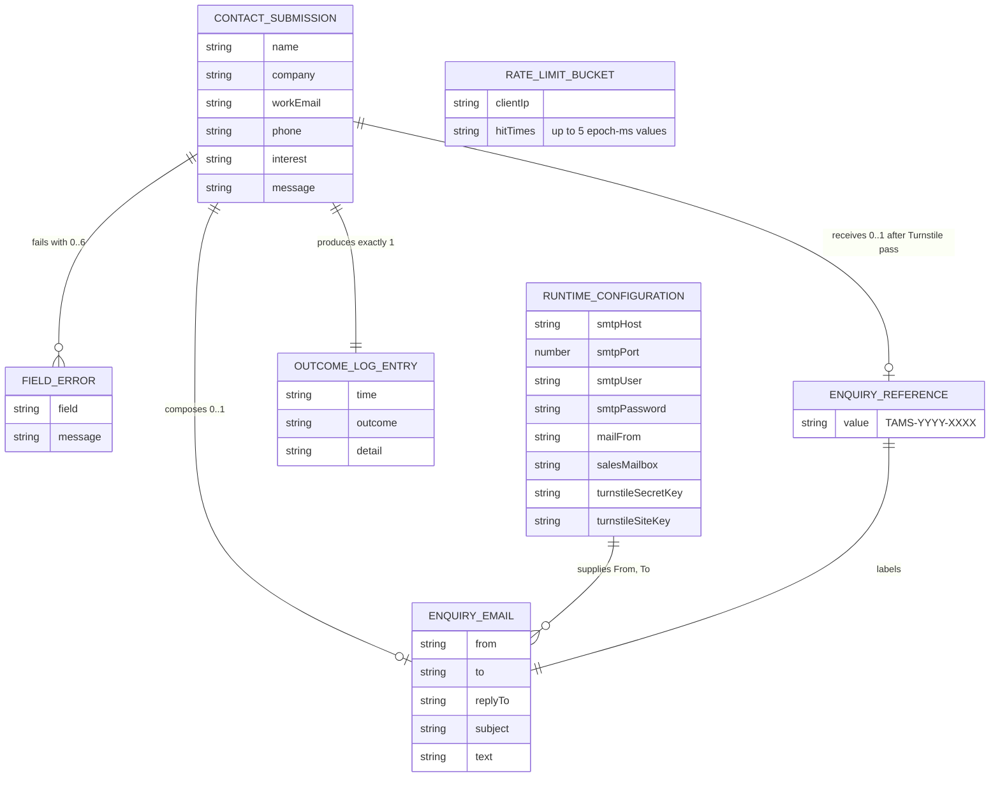

# Data Model: TAMS Infotech Website V1

> Version 2 amended by AMD-001: adds ENT-007 EnquiryReference and the reference in
> ENT-005 subject and body. AMD-002 and AMD-003 change no entity.

## Persistence statement

The system has no database and persists nothing. FR-034 forbids writing any submitted
value to disk, a database, a cache, or a log. The stack profile (section 6) defines no
database. mvp-scope lists "CMS or database" as out of scope.

Every entity below is **transient**. It lives in process memory for one request, or,
for ENT-003, until eviction or process restart. There are no tables, no migrations, no
backups, and no deletion jobs. NFR-009 and NFR-024 confirm no data restore is needed.

"Schema definition" uses TypeScript, the profile's only typed schema language. Types
live in the `src/lib/` module named per entity. Phase 4 MUST implement them exactly.

## Entity relationship diagram



ENT-003 relates to no other entity; its key is the client IP string. On-delete
semantics do not apply: nothing persists, so every relationship ends when the request ends.

---

### ENT-001: ContactSubmission

**Source:** FR-020 to FR-028, FR-032, FR-034
**Lifecycle:** Created by the validator (C-10) for one request. Discarded when the
response is sent. Never written anywhere (FR-034). The browser holds its own copy for
the thank-you state: "Sent to" shows `workEmail`, "Topic" shows `interest` (FR-036).

The table states the validated form. Raw input is `unknown` until C-10 narrows it.

| Field | Type | Null | Constraint | Source |
|---|---|---|---|---|
| name | string | no | trimmed; 1 to 100 code points; no U+0000–U+001F, U+007F | FR-020 |
| company | string | no | trimmed; 1 to 150 code points; no control characters | FR-021 |
| workEmail | string | no | trimmed; 1 to 254 code points; WHATWG `type=email` rule | FR-022 |
| phone | string | no | trimmed; `""` means not provided; else 1 to 20 code points of `[0-9 +()-]`; a calling code alone becomes `""` | FR-023, FR-024 |
| interest | union | no | exactly `Services`, `Solutions`, `Products`, `Careers`, `Other` | FR-025 |
| message | string | no | trimmed; 20 to 4000 code points; line breaks kept | FR-026 |

The Turnstile token is not part of the validated entity. The pipeline reads it
separately at the Turnstile step (FR-028, FR-053). Its wire constraint is in
`api-contract.yaml` (`turnstileToken`, 1 to 2048 characters).

Size bound: 100 + 150 + 254 + 20 + 4000 code points at 4 bytes each is at most 18,096
bytes of text, plus JSON overhead and a 2,048-byte token. This fits the 65,536-byte
limit (NFR-007).

No timestamps: the entity is never stored. FR-032 "Submitted" is computed at send time
(ENT-005).

**Indexes:** none. The entity is never queried.

**Schema definition** (`src/lib/contact-validation.ts`)

```ts
export const INTEREST_OPTIONS = ["Services", "Solutions", "Products", "Careers", "Other"] as const;
export type Interest = (typeof INTEREST_OPTIONS)[number];

export interface ContactSubmission {
  readonly name: string;      // 1..100 code points, trimmed
  readonly company: string;   // 1..150 code points, trimmed
  readonly workEmail: string; // 1..254 code points, WHATWG email
  readonly phone: string;     // "" = not provided; else 1..20 of [0-9 +()-]
  readonly interest: Interest;
  readonly message: string;   // 20..4000 code points, trimmed
}

export type ValidationResult =
  | { ok: true; value: ContactSubmission }
  | { ok: false; error: { code: "VALIDATION_FAILED"; fieldErrors: readonly FieldError[] } };

// callingCodes: from the server metadata (C-11) or the data-calling-codes attribute.
export declare function validateContactSubmission(
  input: unknown,
  callingCodes: ReadonlySet<string>,
): ValidationResult;
```

### ENT-002: FieldError

**Source:** FR-020 to FR-027, FR-037
**Lifecycle:** Created per failing field during one validation. Returned in the 400 body
or rendered by the page. At most one per field, in form order.

| Field | Type | Null | Constraint | Source |
|---|---|---|---|---|
| field | union | no | `name`, `company`, `workEmail`, `phone`, `interest`, `message` | FR-027 |
| message | union | no | one of the seven strings below | FR-020 to FR-026 |

| field | message |
|---|---|
| name | Enter your name. |
| company | Enter your company name. |
| workEmail | Enter a valid email address. |
| phone | Enter a valid phone number. |
| interest | Choose an interest. |
| message (under 20) | Message must be at least 20 characters. |
| message (over 4000) | Message must be at most 4000 characters. |

**Schema definition** (`src/lib/contact-validation.ts`)

```ts
export type FieldName = "name" | "company" | "workEmail" | "phone" | "interest" | "message";
export interface FieldError {
  readonly field: FieldName;
  readonly message:
    | "Enter your name."
    | "Enter your company name."
    | "Enter a valid email address."
    | "Enter a valid phone number."
    | "Choose an interest."
    | "Message must be at least 20 characters."
    | "Message must be at most 4000 characters.";
}
```

### ENT-003: RateLimitBucket

**Source:** FR-042, FR-050, NFR-017
**Lifecycle:** In process memory only. Created on the first POST from a client IP.
Updated on each POST. Removed by eviction when the store exceeds 10,000 keys (oldest
last request first). Lost on restart, which FR-042 permits. Never logged (NFR-017).

| Field | Type | Null | Constraint | Source |
|---|---|---|---|---|
| clientIp (key) | string | no | `CF-Connecting-IP` value, else socket peer address; 1 to 45 characters | FR-050 |
| hitTimes | number[] | no | epoch ms; ascending; at most 5 entries; entries older than 600,000 ms dropped on access | FR-042 |

**Index:** the `Map` key `clientIp`. It serves the one lookup per POST: "hits from this
IP in the last 10 minutes". `Map` insertion order serves eviction: the first key has the
oldest last request (ADR-005).

C-08 MUST trim the `CF-Connecting-IP` value. An empty value, or one longer than 45
characters, MUST be ignored in favor of the socket peer address.

**Schema definition** (`src/lib/rate-limiter.ts`)

```ts
export const RATE_LIMIT_MAX_HITS = 5;
export const RATE_LIMIT_WINDOW_MS = 600_000;
export const RATE_LIMIT_MAX_KEYS = 10_000;

export interface RateLimiter {
  // Records the hit and reports whether it exceeds the limit. `nowMs` is injected for tests.
  recordHit(clientIp: string, nowMs: number): { limited: boolean };
}
export declare function createRateLimiter(): RateLimiter; // backing store: Map<string, number[]>
```

### ENT-004: RuntimeConfiguration

**Source:** NFR-015, FR-024, FR-028, FR-030, FR-033, FR-035
**Lifecycle:** Read from `process.env` at first use in on-demand code. Cached after the
first complete read. Never logged; only variable names may appear in a log `detail`.

| Field | Env variable | Type | Null | Constraint | Source |
|---|---|---|---|---|---|
| smtpHost | `SMTP_HOST` | string | no | non-empty | FR-030 |
| smtpPort | `SMTP_PORT` | integer | no | 1 to 65535; 465 means implicit TLS | FR-030 |
| smtpUser | `SMTP_USER` | string | no | non-empty | NFR-015 |
| smtpPassword | `SMTP_PASSWORD` | string | no | non-empty | NFR-015 |
| mailFrom | `MAIL_FROM` | string | no | WHATWG email; no CR or LF | FR-033 |
| salesMailbox | `SALES_MAILBOX` | string | no | WHATWG email; no CR or LF | FR-030, FR-035 |
| turnstileSecretKey | `TURNSTILE_SECRET_KEY` | string | no | non-empty | FR-028 |
| turnstileSiteKey | `TURNSTILE_SITE_KEY` | string | yes | null means the page renders no widget | FR-048, NFR-015 |

`PORT` and `HOST` belong to the server entry (C-01), not this entity.

**Schema definition** (`src/lib/runtime-config.ts`)

```ts
export interface MailConfiguration {
  readonly smtpHost: string;
  readonly smtpPort: number;
  readonly smtpUser: string;
  readonly smtpPassword: string;
  readonly mailFrom: string;
  readonly salesMailbox: string;
  readonly turnstileSecretKey: string;
}
export type ConfigurationResult =
  | { ok: true; value: MailConfiguration }
  | { ok: false; error: { code: "CONFIGURATION_MISSING"; missingVariables: readonly string[] } };

export declare function readMailConfiguration(): ConfigurationResult;
export declare function readTurnstileSiteKey(): string | null;
```

`CONFIGURATION_MISSING` is internal. The endpoint maps it to `SEND_FAILED` (NFR-015).

### ENT-005: EnquiryEmail

**Source:** FR-030 to FR-035, FR-054
**Lifecycle:** Composed from ENT-001, ENT-004, and ENT-007 just before sending. Passed to the SMTP
sender. Discarded after the send attempt, success or failure. Never queued (FR-034).

| Field | Type | Null | Constraint | Source |
|---|---|---|---|---|
| from | string | no | `mailFrom` | FR-033 |
| to | string | no | `salesMailbox`; the only recipient | FR-030, FR-035 |
| replyTo | string | no | trimmed `workEmail` | FR-033 |
| subject | string | no | `Website enquiry <reference>: <interest> — <company>`; RFC 2047-encoded by the SMTP library. Amended by AMD-001 | FR-031, FR-054 |
| text | string | no | plain text; lines below | FR-032 |

`text` layout, in this order, one label per line, `Message` value verbatim with its line
breaks:

```text
Reference: <reference>
Name: <name>
Company: <company>
Work email: <workEmail>
Phone: <phone, or "Not provided">
Interest: <interest>
Message:
<message>
Submitted: <YYYY-MM-DD HH:mm> IST
```

`Submitted` is the server clock at composition, formatted in `Asia/Kolkata`. The
`Reference` line is the first body line (FR-032, amended by AMD-001).

**Schema definition** (`src/lib/enquiry-email.ts`)

```ts
export interface EnquiryEmail {
  readonly from: string;
  readonly to: string;
  readonly replyTo: string;
  readonly subject: string;
  readonly text: string;
}
export declare function composeEnquiryEmail(
  submission: ContactSubmission,
  reference: EnquiryReference,
  config: MailConfiguration,
  submittedAt: Date,
): EnquiryEmail;
```

### ENT-006: OutcomeLogEntry

**Source:** NFR-018, NFR-017, NFR-015
**Lifecycle:** One per contact endpoint request. Serialized as one JSON line on standard
output. The hosting platform owns retention (NFR-018).

| Field | Type | Null | Constraint | Source |
|---|---|---|---|---|
| time | string | no | ISO 8601 UTC, `Date.prototype.toISOString()` | NFR-018 |
| outcome | union | no | see enum below | NFR-018 |
| detail | string | yes | absent unless configuration is missing; `missing: VAR_A,VAR_B`; names only | NFR-015 |

Outcome per response:

| Response | outcome |
|---|---|
| 200 | `sent` |
| 400 `VALIDATION_FAILED` | `invalid` |
| 403 `SPAM_CHECK_FAILED` | `spam_check_failed` |
| 405 `METHOD_NOT_ALLOWED` | `method_not_allowed` |
| 413 `PAYLOAD_TOO_LARGE` | `payload_too_large` |
| 415 `UNSUPPORTED_MEDIA_TYPE` | `unsupported_media_type` |
| 429 `RATE_LIMITED` | `rate_limited` |
| 502 `SEND_FAILED` | `send_failed` |

**Schema definition** (`src/lib/outcome-log.ts`)

```ts
export type ContactOutcome =
  | "sent" | "invalid" | "rate_limited" | "spam_check_failed" | "send_failed"
  | "payload_too_large" | "unsupported_media_type" | "method_not_allowed";

export interface OutcomeLogEntry {
  readonly time: string;
  readonly outcome: ContactOutcome;
  readonly detail?: string;
}
export declare function writeOutcomeLog(entry: OutcomeLogEntry): void; // process.stdout.write(JSON + "\n")
```

### ENT-007: EnquiryReference

**Source:** FR-054, FR-031, FR-032, FR-036 (added by AMD-001)
**Lifecycle:** Generated by the contact pipeline once per request, only after the body
passes validation (FR-020 to FR-027) and Turnstile verification (FR-028) succeeds, and
before the email is composed. Placed in the ENT-005 subject
`Website enquiry <Reference>: <Interest> — <Company>` and as the first body line.
Returned to the browser in the 200 body `{"status":"sent","reference":"..."}` only when
the send succeeds. Discarded when the request ends. Never stored, never logged (ENT-006
has no reference field), never queued. Not unique: two submissions MAY receive the same
value, and nothing checks for collisions. It is a human-readable label, not a key.

| Field | Type | Null | Constraint | Source |
|---|---|---|---|---|
| value | string | no | matches `^TAMS-\d{4}-[2-9A-HJ-NP-Z]{4}$`; `YYYY` = year in `Asia/Kolkata` at submission; `XXXX` = 4 characters from `23456789ABCDEFGHJKLMNPQRSTUVWXYZ` (32 symbols), each drawn with `crypto.randomInt(32)` | FR-054 |

Rejected-path rule: 400, 403, 405, 413, 415, 429, and a configuration 502 return before
generation. An SMTP 502 occurs after generation; the reference MUST NOT appear in that
response and is discarded.

**Schema definition** (`src/lib/enquiry-reference.ts`)

```ts
declare const enquiryReferenceBrand: unique symbol;
export type EnquiryReference = string & { readonly [enquiryReferenceBrand]: true };

export const REFERENCE_ALPHABET = "23456789ABCDEFGHJKLMNPQRSTUVWXYZ";
export const REFERENCE_PATTERN = /^TAMS-\d{4}-[2-9A-HJ-NP-Z]{4}$/;

// Uses node:crypto randomInt. Math.random is forbidden.
export declare function generateEnquiryReference(now: Date): EnquiryReference;
```

---

## Migrations

None. The system has no persistent store, so there is nothing to order, apply, or roll
back. Rollback of the application is by image tag (NFR-024).

## Traceability check

| Entity | Requirements |
|---|---|
| ENT-001 | FR-020 to FR-028, FR-032, FR-034, FR-036 |
| ENT-002 | FR-020 to FR-027, FR-037 |
| ENT-003 | FR-042, FR-050, NFR-017 |
| ENT-004 | NFR-015, FR-028, FR-030, FR-033, FR-035, FR-048 |
| ENT-005 | FR-030 to FR-035, FR-054 |
| ENT-006 | NFR-015, NFR-017, NFR-018 |
| ENT-007 | FR-054, FR-031, FR-032, FR-036 |

No field exists without a requirement. No entity has creation or modification
timestamps, because none is stored. ENT-003 hit times are the FR-042 window itself.
