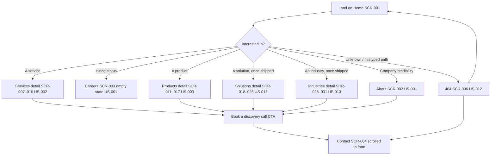
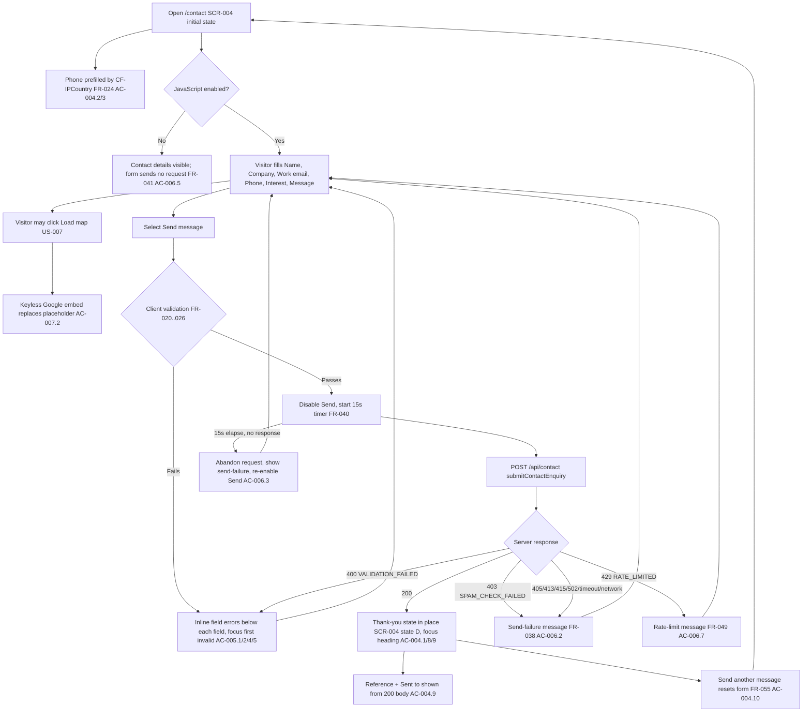
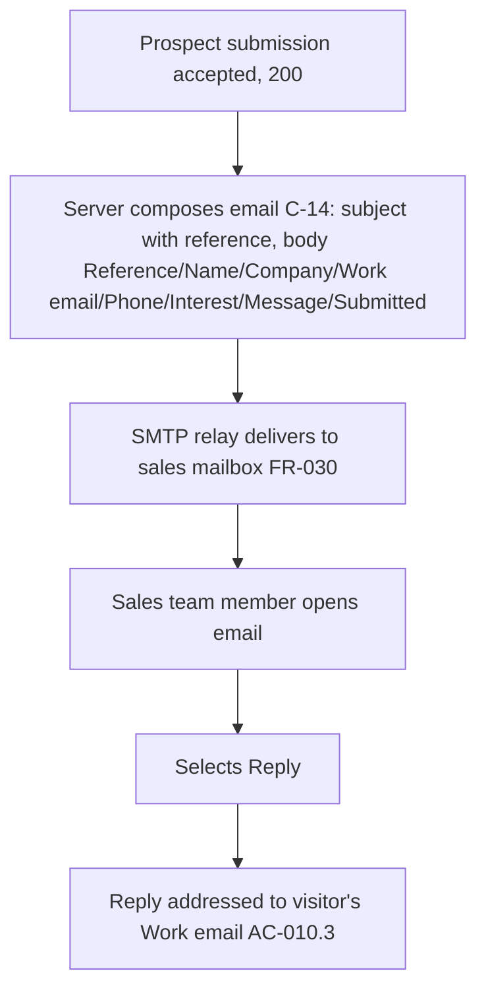
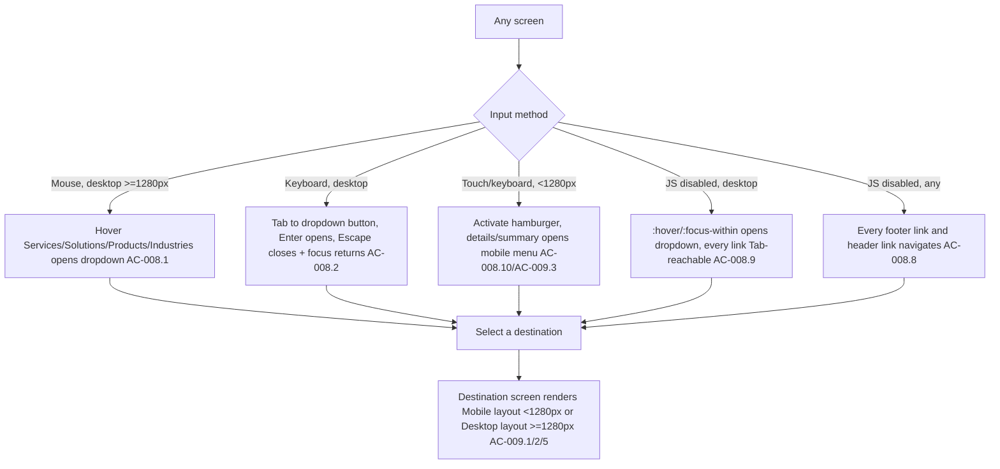

# UI Specification: TAMS Infotech Website V1

## 0. Conventions

- **Rendering model (ADR-001).** Every route except `/contact`, `/api/contact`, and
  `/health` is **prerendered** (`output: "static"`). Prerendered pages carry their full
  populated content in the HTML at first byte — there is **no client-side loading
  skeleton** for any prerendered screen. `/contact` is server-rendered per request
  (on-demand, not prerendered) and is also populated at first paint (the dial-code and
  Turnstile site key are filled server-side before the response is sent) — it does not
  show a loading skeleton either. The only genuine asynchronous **loading** state in the
  product is the Contact form's own submission ("Submitting", section 4.4).
- **Breakpoint (ADR-013).** Desktop layout applies at viewport width `>= --breakpoint-xl`
  (Tailwind `xl:` variant). Mobile layout applies below it, down to 360 px (NFR-020).
  Both layouts render from the same URL; no device redirect (FR-010).
- **Snapshot files.** Every screen names its `desktop/*.jsx` and `mobile/*.jsx` source in
  `docs/03-design/paper-snapshot/`. Section lists below give the section **order and the
  component each maps to**, from `docs/03-design/design-system.md` §7. Exact per-section
  copy for the 25 Services/Products/Solutions/Industries detail screens (SCR-007 to
  SCR-031) MUST be transcribed verbatim from that screen's own snapshot file at build
  time — this document gives the shared template, the H1, the hero paragraph, and the
  route/link table for all of them, not a line-by-line transcription of every body
  section (see §5).
- **Unauthorized state.** The system has no accounts, roles, or sessions (ADR-009,
  mvp-scope Out of Scope). No screen has an "unauthorized" state. Stated once here to
  satisfy the obligation explicitly for every `SCR-###` below.
- **Heading hierarchy.** Every screen: `<h1>` = the hero heading quoted below. Section
  eyebrow + heading pairs are `<h2>`. Card/row titles inside a section are `<h3>`. No
  level is skipped on any screen.
- **Live regions.** The contact form's error summary and status messages use
  `aria-live="assertive"` (immediate, interrupts) for submission outcomes (error, thank
  you) and `aria-live="polite"` for field-level validation as the visitor types/blurs, per
  §4.4.
- **Landmarks.** Every page: `<header>` (site header), `<nav aria-label="Primary">`
  (header nav), `<main>` (one per page, wraps everything between header and footer),
  `<nav aria-label="Breadcrumb">` where present, `<footer>`.
- **Placeholder links (FR-012).** Blog, Case Studies, Terms, Cookies, Sitemap: `href="#"`
  always. Solutions and Industries header/footer links: `href="#"` until SCR-018–031 ship
  (`should` priority); once shipped, `href` = the real route.
- **Book a discovery call (FR-016).** Every instance links to `/contact#contact-form`.
  On `/contact`, JS scrolls to the form without reload; without JS, or on any other page,
  it navigates to `/contact#contact-form` and the browser's native anchor jump lands on
  the form.

---

## 1. Shared shell (every screen)

### Header — desktop (`>= 1280px`)
Snapshot: `desktop/home.jsx` lines 4–74 (confirmed identical on about/careers/contact/
privacy/not-found). Maps to design-system §7.12.

Order: Logo mark + "TAMS Infotech" wordmark (`<a href="/">`, accessible name "TAMS
Infotech, home") → primary nav `<ul>`: Home, Services▾, Solutions▾, Products▾,
Industries▾, About Us, Careers, Contact Us → search icon (decorative; `BLOCKED:` if the
user wants it functional — no in-scope screen shows search results) → "Book a discovery
call" pill.

Dropdown items (Services, Solutions, Products, Industries): `<button aria-expanded="false"
aria-controls="menu-services">Services</button>` + chevron, per ADR-012. Panel per
design-system §7.13 (single-column link list; labels/routes below). Current-page nav item
shown accent-highlighted (confirmed on about.jsx/careers.jsx/contact.jsx/privacy.jsx —
"About Us"/"Careers"/"Contact Us" render `text-accent-inverse font-semibold` on their own
page; Home has no highlighted item captured, treat Home's own nav item the same way).

Dropdown panel link sets (label = captured screen H1, route = FR table; §7.13 gap noted):
- **Services** → S/4HANA Cloud Implementation `/services/s4hana-cloud-implementation`;
  S/4HANA Managed Services `/services/s4hana-managed-services`; Custom Application Build
  `/services/custom-application-build`; License Procurement `/services/license-procurement`.
- **Products** → Gate Entry Application `/products/gate-entry`; EXIM (Export and Import
  Management) `/products/exim`; TAMS DigiSign `/products/digisign`; TAMS Production
  Process `/products/production-process`; TAMS Vendor Portal `/products/vendor-portal`;
  TAMS Connected Factory `/products/connected-factory`; TAMS Digital Manufacturing & AI
  `/products/digital-manufacturing-ai`.
- **Solutions** → each of the 8 SCR-018–025 labels/routes (§5.3 table); `href="#"` on
  every link until FR-046 ships (FR-012).
- **Industries** → each of the 6 SCR-026–031 labels/routes (§5.4 table); `href="#"` on
  every link until FR-047 ships (FR-012).

Keyboard: Tab reaches each dropdown `<button>`; Enter/Space opens; Escape closes and
returns focus to the button; Tab from the last link closes the menu and moves to the
next header item (FR-014). Without JS: `:hover`/`:focus-within` opens the panel; every
link is Tab-reachable (FR-051, ADR-012).

### Header — mobile (`< 1280px`)
Snapshot: `mobile/contact.jsx` lines 4–31 (confirmed pattern; identical chrome on every
mobile screen file per MANIFEST naming). Logo + wordmark, current-page pill badge (e.g.
"Contact Us"), search icon, hamburger (`<button aria-expanded="false"
aria-controls="mobile-menu">` accessible name "Open menu").

Mobile menu panel: design-system §7.14. `
` with `
` =
the hamburger button (native, no-JS operable per ADR-012/FR-015/FR-051); rows: Home,
Services▾ (expands to the same 4 links as desktop), Solutions▾ (8 links), Products▾ (7
links), Industries▾ (6 links), About Us, Careers, Contact Us; "Contact us" pill CTA;
close via the `×` icon or Escape (JS enhancement, FR-015 edge case: menu closes on link
follow).

### Footer — desktop and mobile
Snapshot: `desktop/contact.jsx` lines 308–439 / `mobile/contact.jsx` lines 267–398
(confirmed byte-identical structure across about/careers/privacy/not-found; **assumption**
that `home.jsx`'s footer matches — not fully read within tool budget; if it differs,
report `BLOCKED:` at Phase 4). Maps to design-system §7.15.

Order: brand block (logo, "TAMS Infotech" wordmark, one-paragraph description, address/
phone/email rows with icons) → Services column (4 links, `/services/*`) → Products column
(7 links, `/products/*`) → Company column (About Us `/about`, Careers `/careers`, Contact
Us `/contact`) → legal row (`© 2026 TAMS Infotech Pvt. Ltd.` left; Privacy `/privacy`,
Terms `#`, Cookies `#`, Sitemap `#` right) → trademark disclaimer paragraph → oversized
"TAMS INFOTECH" wordmark band (`aria-hidden="true"`, decorative, duplicates the header
wordmark's accessible name so it MUST NOT be exposed to assistive tech twice).

Mobile: same content, single column, sections stack (confirmed section-for-section
against `mobile/contact.jsx`), wordmark band shrinks from `--text-132` to `--text-56`
(existing Meridian typography tokens; the wordmark band is set in `--font-display` at
these sizes, not a bespoke dimension).

Every footer link MUST navigate without JavaScript (FR-051 edge case, AC-008.8).

---

## 2. Global states table

Applies to every `SCR-###` unless the screen's own section overrides it.

| State | Applies | Behaviour |
|---|---|---|
| Loading | N/A for every prerendered screen (§0). `/contact` server-renders before first byte. | — |
| Empty | Only SCR-003 Careers (open-roles table) | See SCR-003 |
| Populated | Default state for every screen | Content as captured |
| Error | Only SCR-004 Contact (field errors, send-failure, rate-limit) and SCR-006 (404 page itself *is* the site-wide error state for unknown routes) | See SCR-004, SCR-006 |
| Unauthorized | Not applicable to any screen (§0) | — |

---

## 3. User flows

Every `US-###` appears in at least one flow below.

### 3.1 Prospect evaluates the company and finds a fit (US-001, US-002, US-003, US-013)

### 3.2 Contact form submission, success and every failure branch (US-004, US-005, US-006, US-007, US-010)

### 3.3 Sales team member acts on an enquiry email (US-010)

### 3.4 Navigation without JavaScript, keyboard-only, and on a phone (US-008, US-009)

---

## 4. Screens

### SCR-001 — Home

**Route:** `/` · **Priority:** must · **FR:** FR-001, FR-010, FR-011, FR-012, FR-013,
FR-014, FR-016, FR-043, FR-044, FR-045 · **US:** US-001
**Snapshot:** `desktop/home.jsx` (73,801 bytes) / `mobile/home.jsx` (70,709 bytes)
**API:** none (static page).

**Sections, in order** (design-system component in parentheses):
1. Header (§1) — dark, on dark hero, no breadcrumb (Home has none).
2. Hero (§7.10 standard variant, no breadcrumb) — eyebrow "SAP Gold Partner ·
   Manufacturing only" → **H1**: "Stop Managing Problems. Start Driving Profits with
   SAP." → hero paragraph (FR-044 source, exactly): "TAMS Infotech delivers high-impact
   SAP ERP solutions that eliminate inefficiencies, automate operations, and unlock
   real-time business intelligence — so you scale faster and outperform competitors." →
   two CTAs: "Accelerate Your Digital Transformation" (`href="/contact#contact-form"`)
   and "See what we have built" (`href="#products-section"` in-page anchor) → stat rail
   (5 stats: 14+ years, 25 consultants, 25+ projects, 5 countries, 7 products).
3. "What are you facing?" (Table, §7.8) — 2-column comparison table, 5 rows, each row:
   problem statement + arrow icon + SAP outcome statement.
4. "Four services, one lifecycle" (Card ×4, §7.7) — "All services" outline pill →
   `href="#"` (orchestrator resolution, 2026-09-22: no `/services` index route exists —
   FR-006 edge case, `/services` returns 404 — so this pill links to `#` per FR-012, same
   as the Blog/Case Studies/Terms/Cookies/Sitemap placeholder pattern).
5. "Every SAP partner implements. We also build." (Products, Card ×7 + 1 CTA card) — each
   card links to its `/products/*` route; final card "See what we have built" CTA.
6. "From ERP to the shop floor" (dark section) — 2 feature cards (Connected Factory,
   Digital Manufacturing & AI) with stat callouts + "Explore …" links to
   `/products/connected-factory` and `/products/digital-manufacturing-ai`; below, a
   6-node data-flow diagram (decorative, `aria-hidden="true"`, caption text stays visible).
7. "Solutions guiding your SAP journey" (Card ×8) — each links to its `/solutions/*`
   route once FR-046 ships; `href="#"` until then (FR-012). "All solutions" pill: same
   resolution as item 4 — `href="#"` (`/solutions` returns 404 per FR-046 edge case).
8. "We only work with manufacturers" (Card ×6, Industries) — each links to its
   `/industries/*` route once FR-047 ships; `href="#"` until then (FR-012), same
   resolution as item 7.
9. "How we work" (7-step numbered process rail) — no links.
10. Closing CTA band (§7.11) — **truncated in this capture at line 859/1086. Orchestrator
    resolution (2026-09-22): the developer MUST read the unread tail of
    `desktop/home.jsx` (lines 860–1086) directly and build the final section(s) from that
    snapshot** before the footer; this specification does not invent that content.
    Expected pattern from every sibling screen: closing CTA band then Footer.
11. Footer (§1).

**States:** Populated only (§2). No loading/empty/error/unauthorized state applies.

**Accessibility:** `<h1>` = hero heading; `<h2>` per numbered section above; `<h3>` per
card title. Stat rail numbers are decorative-adjacent data — expose as plain text, not
`aria-hidden`. Data-flow diagram SVG: `aria-hidden="true"`, the caption sentence "It
reads from the machine layer. It never writes to it." stays in the accessibility tree.
Tab order follows visual order top-to-bottom, left-to-right within each row.

---

### SCR-002 — About

**Route:** `/about` · **Priority:** must · **FR:** FR-002, FR-011, FR-043, FR-044 ·
**US:** US-001
**Snapshot:** `desktop/about.jsx` (36,548 bytes) / `mobile/about.jsx` (33,921 bytes)
**API:** none.

**Sections, in order:**
1. Header (§1) + Breadcrumb "Home / About Us".
2. Hero (§7.10) — eyebrow "About" → **H1**: "About TAMS Infotech" → hero paragraph
   (FR-044 source): "An SAP Gold Partner in Bengaluru, working only with Indian
   manufacturers." → "Book a discovery call" CTA.
3. "Who we are" (eyebrow "The firm", `text-48/display` H2) — intro paragraph + highlight
   callout card ("Twenty-five SAP consultants, fourteen years, more than twenty-five
   project deliveries, and support across five countries.").
4. "Why manufacturing only" (dark full-bleed band) — H2 `text-56/display` + body copy,
   no CTA, decorative grid-pattern SVG background.
5. "What makes us different" (Card ×N, differentiators — SAP Gold Partner, Seven
   products of our own, and additional cards not fully captured within budget; developer
   MUST transcribe the complete card set from `desktop/about.jsx` starting line 167).
6. "Our process" section (per grep line 274 — same 7-step process pattern as Home;
   transcribe from source).
7. Closing CTA band (§7.11) — confirmed at line 418: H2 "Tell us what is breaking".
8. Footer (§1).

**States:** Populated only.

**Accessibility:** `<h1>` "About TAMS Infotech"; `<h2>` per section; the highlight
callout card's stat sentence is a `
` inside the section, not a separate heading level.

---

### SCR-003 — Careers

**Route:** `/careers` · **Priority:** must · **FR:** FR-003, FR-004, FR-011, FR-043,
FR-044 · **US:** US-001
**Snapshot:** `desktop/careers.jsx` (38,920 bytes) / `mobile/careers.jsx` (36,316 bytes)
**API:** none.

**Sections, in order:**
1. Header (§1) + Breadcrumb "Home / Careers".
2. Hero (§7.10) — eyebrow "Careers" → **H1**: "Careers at TAMS" → hero paragraph
   (FR-044 source): "SAP consultants who want to work on manufacturing problems, not
   tickets." → "Book a discovery call" CTA.
3. "What it is like here" (eyebrow "The work") — intro paragraph.
4. "How we develop consultants" (dark section) — intro + 6 module-track chips (ABAP,
   FICO, PP/QM/PM, SD, MM, Basis).
5. "Open roles" (Table, §7.8) — see **Resolved** note below for this section's content.
6. Footer (§1) — no closing CTA band was captured before the footer within budget;
   developer MUST confirm against `desktop/careers.jsx` whether one exists between
   section 5 and the footer (every other content screen has one).

**Resolved (user decision, 2026-09-22 ~18:45 PDT — see
`.lonewolf/interviews/02-functional.md` "Phase 3 UI designer BLOCKED items").** The
frozen snapshot (`desktop/careers.jsx` lines 201–420+) shows the "Open roles" table
**populated** with a "6 roles open" success badge and 5+ role rows (SAP MM Consultant,
SAP PP/QM Consultant, SAP ABAP/RAP Developer, SAP FICO Consultant, SAP Basis
Administrator, …), each with an "Apply" button. This conflicted with FR-004, which
requires the table in its "no openings available" state. The user resolved the
conflict: **FR-004 wins**. Keep the design's table header/shell (Role / Module /
Location / Experience columns, from the snapshot's own column labels — legitimate
structural chrome, not per-role content); render **zero data rows** and **remove** the
"6 roles open" badge and every "Apply" button. A single row/cell reads exactly
"No openings available" (user-supplied copy, not invented by this agent).

**States:** Empty (per FR-004, resolution above) is the only state defined for the Open
roles section: header row present, `<tbody>` contains exactly one row spanning all
columns, cell text "No openings available". Rest of page: Populated only.

**Accessibility:** `<h1>` "Careers at TAMS"; Open roles `<table>` with a `<caption>`
(visually hidden) stating "Open roles" so screen reader users get the empty-table
context; the single "No openings available" row uses a `<td colspan="4">` (or the
actual column count), not a decorative-only element, so it is announced in the table's
normal reading order.

---

### SCR-004 — Contact

**Route:** `/contact` (on-demand render, ADR-001; `Cache-Control: private, no-store`,
FR-024) · **Priority:** must · **FR:** FR-005, FR-012, FR-016, FR-017, FR-018, FR-019,
FR-020–FR-042, FR-048–FR-055, FR-011, FR-043, FR-044 · **US:** US-004, US-005, US-006,
US-007, US-010
**Snapshot:** `desktop/contact.jsx` (28,007 bytes) + `desktop/contact-thank-you.jsx`
(9,426 bytes, thank-you state) / `mobile/contact.jsx` (25,692 bytes) +
`mobile/contact-thank-you.jsx` (9,409 bytes)
**API:** `submitContactEnquiry` (`POST /api/contact`).

**Sections, in order (states A–D below replace only the two-column content area, item
3; header, hero, and footer are constant across all states):**
1. Header (§1) + Breadcrumb "Home / Contact Us".
2. Hero (§7.10) — eyebrow "Contact" → **H1**: "Talk to someone who has done this in a
   plant" → hero paragraph (FR-044 source): "Thirty minutes, no deck, no discovery
   questionnaire. Bring the actual problem." → "Book a discovery call" CTA
   (`href="#contact-form"`, in-page scroll per FR-016).
3. Two-column content area, `id="contact-form"` container wraps the right column:
   - **Left column** (constant across every state): eyebrow "Office" → H2
     "TAMS Infotech Pvt. Ltd." → address row "Bengaluru, Karnataka, India" → Phone/Email
     data pair ("+91 80 4130 1039", "sales@tamsinfotech.com", FR-005) → "What happens
     next" H3 + paragraph → Map card (§7.16): placeholder state and loaded state
     (FR-017–019).
   - **Right column**: State A (initial form), B (field errors), C (submitting), or D
     (thank-you) — see below.
4. Footer (§1).

**State A — Initial (default on every fresh load, FR-024/FR-025).**
Form fields, in order, each per design-system §7.2 (text inputs)/§7.3 (Interest
select)/§7.4 (Message textarea):
- Name (text, required, 1–100 chars, FR-020) — accessible name "Name".
- Company (text, required, 1–150 chars, FR-021) — accessible name "Company".
- Work email (text `type=email`, required, ≤254 chars, FR-022) — accessible name
  "Work email".
- Phone (text, optional, ≤20 chars, FR-023) — accessible name "Phone". **Value at
  render**: `"<calling code> "` per FR-024 (e.g. `+91 `), server-filled, editable.
- Interest — **resolved (user decision, 2026-09-22 ~18:45 PDT)**: implement as a native
  `<select>` styled to match the design's CLOSED dropdown field (design-system §7.3).
  The open option-list rendering in the snapshot is that same control's **open state**,
  not a second control — the snapshot's separate 5-pill chip row is not built; it does
  not exist as an independent field. Options, in order: an empty placeholder option
  first (`value=""`, label "Select an interest" — or equivalent placeholder copy),
  followed by Services, Solutions, Products, Careers, Other. The placeholder option is
  selected by default so the field starts unselected (FR-025). Accessible name
  "Interest" (associated `<label>`).
- Message (textarea, required, 20–4000 chars, FR-026) — accessible name "Message".
- Helper line: "Routed straight to the right team. Reply within one working day."
- "Send message" button (primary, §7.1) — accessible name "Send message"; enabled.
- Turnstile widget container (ADR-007) — renders nothing visible (`appearance:
  interaction-only`, FR-048) unless Cloudflare requires interaction; not captured in the
  snapshot because it is invisible by design at rest.

**State B — Field error (FR-037, AC-005.1–.10).**
Same fields as State A, values preserved. Each invalid field: border
`--border-width-thick` (derived token — see design-system.md "Derived tokens" for its
value) `--color-danger`, helper text below (`text-12 text-danger`, exact strings from
`api-contract.yaml` `FieldErrorMessage` enum — "Enter your name.", "Enter your company
name.", "Enter a valid email address.", "Enter a valid phone number.", "Choose an
interest.", "Message must be at least 20 characters.", "Message must be at most 4000
characters."), `aria-invalid="true"`, `aria-describedby` = the error `
`'s `id`. Focus
moves to the first invalid field on validation (client-side, FR-037) or on a 400 response
(server-side, same rendering, FR-037 "A 400 response with field entries MUST render those
errors in the same way"). Error announcements: `aria-live="polite"` region above the form
summarizing "N field(s) need attention," in addition to the per-field
`aria-describedby` text (belt-and-braces per NFR-021).
No visual for this state exists in the TAMS Contact screen capture; error chrome is
transcribed from `design-system/02-actions-and-forms.jsx` "Text fields" error example
(border-danger + red helper text), per the task's explicit fallback instruction.

**State C — Submitting (FR-039, FR-040).**
"Send message" button: `opacity-40`, `aria-disabled="true"`, `aria-busy="true"`, all
fields `disabled` is **not** required (FR-040 only disables the submit control) — fields
stay editable-looking but the button cannot be re-activated. 15-second client timeout
(FR-039); on timeout, transition directly to the send-failure message (State B' below)
without a server response.

**State B' — Send failure / rate limit (FR-038, FR-049).**
Same layout as State B, but the message is a page-level banner above the form (not
per-field), `aria-live="assertive"`, values preserved, "Send message" re-enabled:
- `SPAM_CHECK_FAILED`, `SEND_FAILED`, unexpected status, network failure, or the 15s
  client timeout: "We couldn't send your message. Please try again, or email
  sales@tamsinfotech.com." (FR-038).
- `RATE_LIMITED`: "Too many messages. Please try again in a few minutes." (FR-049).

**State D — Thank you (FR-036, FR-054, FR-055).**
Snapshot: `desktop/contact-thank-you.jsx` / `mobile/contact-thank-you.jsx`. Replaces the
right column in place; URL unchanged (FR-036). Order: `--size-icon-xl` (derived token,
design-system.md "Derived tokens") check icon → eyebrow "Message sent" → **H1** "That is with us." → body copy →
data rows:
  - "Sent to" = the submitted, trimmed Work email (client-held value, not echoed by the
    API — data-model.md ENT-001 lifecycle note).
  - "Topic" = the submitted Interest value (client-held).
  - "Reference" = the `reference` field of the 200 response body (matches
    `^TAMS-\d{4}-[2-9A-HJ-NP-Z]{4}$`).
→ "Send another message" (secondary button, §7.1) → helper line "Wrong address, or
forgot something? Send another and we will merge the two."
Focus moves to the `<h1>` on entering this state (FR-036, AC-004.8). Activating "Send
another message" returns State A exactly (fresh Turnstile token, Phone re-prefilled,
Interest unselected), focus moves to Name (FR-055, AC-004.10).

**Flagged snapshot placeholder content (must bind to runtime values, not ship as-is):**
- `desktop/contact-thank-you.jsx` "Sent to" shows `ops@northaid.example` — this is the
  `api-contract.yaml` example submission's email, captured verbatim by Paper. Bind to
  the visitor's actual trimmed Work email at runtime (FR-036).
- "Reference" shows `TAMS-2026-0412` — captured example data. Bind to the 200 response
  body's `reference` field at runtime (FR-054). Note this example does not even match the
  reference alphabet (`0` and `1` are excluded from `23456789ABCDEFGHJKLMNPQRSTUVWXYZ`
  per ENT-007) — further confirming it is placeholder, not a literal value to reproduce.
- "Topic" shows "Services" — bind to the visitor's submitted Interest value.

**Map (FR-017–019, §7.16):** placeholder → on "Load map" click, replaced by
`<iframe src="https://www.google.com/maps?q=<encoded address>&output=embed" title="Map
of the TAMS Infotech Bengaluru office" loading="lazy"
referrerpolicy="strict-origin-when-cross-origin">` at the same fixed `--spacing-map-height`
(derived token, design-system.md "Derived tokens") height (no layout shift, NFR-003).
Address per FR-019, `encodeURIComponent`-encoded (ADR-010).
Without JS, the placeholder and "Load map" button remain static and inert — no request
occurs (FR-017 edge case).

**States:** Loading N/A (§0). Empty N/A. Populated = State A. Error = State B / State B'.
Unauthorized N/A. Submitting (State C) and Thank-you (State D) are additional
product-specific states beyond the required five, both specified above.

**Accessibility:** `<h1>` per state ("Talk to someone…" in A/B/C, "That is with us." in
D — note the H1 text itself changes with state; FR-043's page `<title>` is fixed at
document load from the initial-state H1 and does NOT change on the client-side state
transition, since the URL and document do not navigate). Tab order: Name → Company →
Work email → Phone → Interest (native `<select>`, arrow keys change value while open per
platform behaviour) → Message → Send message.
Every error is linked via `aria-describedby` (FR-037). Turnstile's own accessibility is
Cloudflare-owned (NFR-022 edge case).

---

### SCR-005 — Privacy Policy

**Route:** `/privacy` · **Priority:** must · **FR:** FR-008, FR-011, FR-043, FR-044 ·
**US:** US-012
**Snapshot:** `desktop/privacy.jsx` (74,329 bytes) / `mobile/privacy.jsx` (69,113 bytes)
**API:** none.

**Sections, in order:**
1. Header (§1) — no breadcrumb captured in the first 140 lines; confirm at build time.
2. Hero (dark, §7.10 standard) — eyebrow "Legal" → **H1**: "Privacy policy" → hero
   paragraph (FR-044 source): "How TAMS Infotech collects, uses and protects personal
   data, and what you can ask us to do with it. Written to meet the UK and EU General
   Data Protection Regulation and India's Digital Personal Data Protection Act, 2023." →
   3 amber "to confirm" badges: "to confirm — effective date", "to confirm — version
   number", "to confirm — last reviewed by counsel" (warning chip, §"Colour tokens"
   `--color-warning-soft`/`-on`). These badges are **static content to ship as-is**
   per FR-008 ("the page MUST show the draft text exactly as the screen shows it") — they
   are not a runtime binding, they are the legal draft's own acknowledgment of its
   unfinished state.
3. Draft banner (full-width `--color-warning-soft` band): "Draft — not yet legal advice"
   chip + explanatory paragraph, verbatim from the snapshot, shown as-is (FR-008).
4. Body sections, each following the pattern "Identity / Who we are" (Legal entity
   definition-list row shown at line 134+): the full legal document. **Developer MUST
   transcribe every subsequent section verbatim from `desktop/privacy.jsx` in DOM order**
   (74KB of legal text; this specification does not re-key it — FR-008's "matches its
   screen" test is a direct source-to-output comparison, not a paraphrase through this
   document). Use `<h2>` for each top-level legal section (data-model style: "Identity,"
   and subsequent named sections), `<h3>` for sub-points, `<dl>` for the
   label/value definition rows (e.g. "Legal entity").
5. Footer (§1).

**States:** Populated only.

**Accessibility:** `<h1>` "Privacy policy"; every amber "to confirm" badge exposed as
plain inline text (not a tooltip), since it is part of the legal content itself.

---

### SCR-006 — 404 Not Found

**Route:** every path no other FR defines (FR-009) · **Priority:** must · **FR:** FR-009,
FR-011, FR-043 (title uses this screen's own H1, not `og:url`, FR-045 edge case) ·
**US:** US-012
**Snapshot:** `desktop/not-found.jsx` (24,019 bytes) / `mobile/not-found.jsx`
(21,280 bytes)
**API:** none. HTTP status MUST be 404 (FR-009), not 200.

**Sections, in order:**
1. Header (§1).
2. Hero (dark) — eyebrow "Page not found" → oversized "404" numeral (`text-186/none`,
   `aria-hidden="true"` decorative — the numeral is not the accessible H1) → **H1**
   (`text-56/display`): "That page has moved, been renamed, or never existed." → body
   copy: "No need to start again from the homepage — the six places worth going are
   below. If you followed a link from somewhere and it broke, tell us and we will fix
   it." → two CTAs: "Go to the homepage" (`href="/"`) and "Report a broken link"
   (`href="/contact#contact-form"`, FR-016).
3. "Where you were probably heading" (Card ×6, §7.7) — Services (`href="#"`, orchestrator
   resolution 2026-09-22: no `/services` index route exists, FR-012), Solutions,
   Products, Industries, About us (`/about`), Contact (`/contact`).
4. "Still cannot find it?" (light-sunk section) — body copy + "Contact us" text link
   (`href="/contact#contact-form"`).
5. Footer (§1).

**States:** This screen **is** the site-wide error/empty state for unknown routes
(§2). It has no further loading/empty/error/unauthorized sub-states of its own.

**Accessibility:** `<h1>` = "That page has moved, been renamed, or never existed." (the
"404" numeral is presentational, per WCAG heading-text guidance do not put "404" in the
`<h1>`). `<title>` per FR-043 edge case uses this H1, not "404".

---

## 5. Detail page template — Services, Products, Solutions, Industries (SCR-007–031)

All 25 screens share one structural template, confirmed by grepping the hero heading and
closing-CTA heading across every file in `desktop/{services,products,solutions,
industries}-*.jsx`: every file places its H1 at the same offset pattern (hero, lines
~100–115) and its closing CTA H2 "Tell us what is breaking" near the end, immediately
before the footer. Section **order**:

1. Header (§1) + Breadcrumb "Home / <Family> / <Page title>" (e.g. "Home / Services /
   S/4HANA Cloud Implementation" — exact breadcrumb wording not captured within budget;
   developer MUST confirm the middle crumb level against each file; if a family index
   crumb is not present, use "Home / <Page title>" matching the pattern SCR-002–005 use).
2. Hero (§7.10 standard) — eyebrow = family name ("Services"/"Products"/"Solutions"/
   "Industries") → **H1** = table below → hero paragraph (FR-044 source) = table below →
   "Book a discovery call" CTA.
3. **N body sections**, count and content varying per screen (confirmed file sizes range
   30KB–63KB; Products — TAMS Production Process is the largest at 63,164 bytes,
   suggesting the most sections). Each body section MUST be transcribed from that
   screen's own snapshot file, in DOM order, and each section maps to one of: Card grid
   (§7.7, feature/capability tiles), Table (§7.8, comparison rows — confirmed pattern
   reused from Home's "What are you facing?"), stat/evidence band (dark section, numeric
   callouts — confirmed pattern reused from Home's Connected Factory cards), or process
   rail (numbered steps — confirmed pattern reused from Home/About/Careers "how we
   work"/"how we develop"). No new component beyond design-system §7 is permitted; if a
   screen's section does not fit one of these, report `BLOCKED:`.
4. Closing CTA band (§7.11) — identical copy on every one of the 25 screens: eyebrow →
   H2 "Tell us what is breaking" → paragraph "Thirty minutes with a consultant who has
   done this in a plant. No deck, no discovery questionnaire." → "Book a discovery call"
   CTA.
5. Footer (§1).

**Mobile.** Confirmed (via the Contact/Home/mobile-blocks comparison) that the mobile
layout preserves the same section order as desktop, single column, `px-5` gutter,
display type stepped down one rung (§ design-system 5). **Assumption**: the same holds
for all 25 detail-page mobile files; not individually verified within tool budget. If a
mobile file reorders or omits a desktop section, that is a `BLOCKED:` finding for the
frontend developer to raise against this specification, not a silent deviation.

**States:** Populated only, for every screen in this family (§2).

**Accessibility:** `<h1>` = table below. `<h2>` per body section per its own eyebrow.
Card grids use `<h3>` per card title. Comparison tables use `<table>` semantics per §7.8.

### 5.1 Services — SCR-007 to SCR-010 (FR-006, US-002)

| SCR | Route | Snapshot (desktop/mobile) | H1 | Hero paragraph |
|---|---|---|---|---|
| SCR-007 | `/services/s4hana-cloud-implementation` | `services-s4hana-cloud-implementation.jsx` | SAP S/4HANA Cloud Implementation | *(not captured within budget — transcribe from source line ~109)* |
| SCR-008 | `/services/s4hana-managed-services` | `services-s4hana-managed-services.jsx` | SAP S/4HANA Managed Services | *(transcribe from source line ~109)* |
| SCR-009 | `/services/custom-application-build` | `services-custom-application-build.jsx` | Custom Application Build | *(transcribe from source line ~109)* |
| SCR-010 | `/services/license-procurement` | `services-license-procurement.jsx` | License Procurement | *(transcribe from source line ~109)* |

### 5.2 Products — SCR-011 to SCR-017 (FR-007, US-003)

| SCR | Route | Snapshot | H1 | Hero paragraph |
|---|---|---|---|---|
| SCR-011 | `/products/gate-entry` | `products-gate-entry.jsx` | Gate Entry Application | *(transcribe, line ~109)* |
| SCR-012 | `/products/exim` | `products-exim.jsx` | Export and Import Management | *(transcribe, line ~109)* |
| SCR-013 | `/products/digisign` | `products-digisign.jsx` | TAMS DigiSign | *(transcribe, line ~109)* |
| SCR-014 | `/products/production-process` | `products-production-process.jsx` | TAMS Production Process | *(transcribe, line ~109)* |
| SCR-015 | `/products/vendor-portal` | `products-vendor-portal.jsx` | TAMS Vendor Portal | *(transcribe, line ~109)* |
| SCR-016 | `/products/connected-factory` | `products-connected-factory.jsx` | TAMS Connected Factory | *(transcribe, line ~109)* |
| SCR-017 | `/products/digital-manufacturing-ai` | `products-digital-manufacturing-ai.jsx` | TAMS Digital Manufacturing & AI | *(transcribe, line ~109)* |

Note: FR-007's route table calls this screen "Products — EXIM Application" but the
captured H1 text is "Export and Import Management." Use the captured H1 verbatim for the
page (design match, FR per §0 conventions); the FR table's parenthetical name is the
screen's internal label, not on-page copy.

### 5.3 Solutions — SCR-018 to SCR-025 (FR-046, should, US-013)

| SCR | Route | Snapshot | H1 | Hero paragraph |
|---|---|---|---|---|
| SCR-018 | `/solutions/rise-with-sap` | `solutions-rise-with-sap.jsx` | RISE with SAP | *(transcribe, line ~109)* |
| SCR-019 | `/solutions/grow-with-sap` | `solutions-grow-with-sap.jsx` | GROW with SAP | *(transcribe, line ~109)* |
| SCR-020 | `/solutions/sap-btp` | `solutions-sap-btp.jsx` | SAP BTP | "Application development, automation, data management, analytics, planning, integration and AI, brought together on one platform." |
| SCR-021 | `/solutions/sap-business-ai` | `solutions-sap-business-ai.jsx` | SAP Business AI | *(transcribe, line ~109)* |
| SCR-022 | `/solutions/industry-specific-sap-solutions` | `solutions-industry-specific-sap-solutions.jsx` | Industry-specific SAP solutions | *(transcribe, line ~109)* |
| SCR-023 | `/solutions/sap-analytics-and-reporting` | `solutions-sap-analytics-and-reporting.jsx` | SAP Analytics and Reporting | *(transcribe, line ~109)* |
| SCR-024 | `/solutions/sap-integration-suite` | `solutions-sap-integration-suite.jsx` | SAP Integration Suite | *(transcribe, line ~109)* |
| SCR-025 | `/solutions/sap-automation-and-workflow` | `solutions-sap-automation-and-workflow.jsx` | SAP Automation and Workflow | *(transcribe, line ~109)* |

Until these ship, every Solutions link site-wide is `href="#"` (FR-012).

### 5.4 Industries — SCR-026 to SCR-031 (FR-047, should, US-013)

| SCR | Route | Snapshot | H1 | Hero paragraph |
|---|---|---|---|---|
| SCR-026 | `/industries/automotive` | `industries-automotive.jsx` | SAP for automotive and auto components | *(transcribe, line ~109)* |
| SCR-027 | `/industries/metals-and-steel` | `industries-metals-and-steel.jsx` | SAP for metals and steel | *(transcribe, line ~109)* |
| SCR-028 | `/industries/mill-products` | `industries-mill-products.jsx` | SAP for mill products | *(transcribe, line ~109)* |
| SCR-029 | `/industries/pharmaceuticals` | `industries-pharmaceuticals.jsx` | SAP for pharmaceuticals | *(transcribe, line ~109)* |
| SCR-030 | `/industries/engineering-and-fabrication` | `industries-engineering-and-fabrication.jsx` | SAP for engineering and fabrication | *(transcribe, line ~109)* |
| SCR-031 | `/industries/consumer-durables` | `industries-consumer-durables.jsx` | SAP for consumer durables | *(transcribe, line ~109)* |

Until these ship, every Industries link site-wide is `href="#"` (FR-012).

---

## 6. Meta / SEO binding (every screen, FR-043–045)

- `<title>` = `<H1 text> | TAMS Infotech` (FR-043). 404: uses its own H1 (§ SCR-006).
- `<meta name="description">` = the hero introduction paragraph, trimmed to ≤160 chars
  at a word boundary + `…` if cut (FR-044). Every H1/hero pair in §4 and §5 is the
  source; screens with no captured hero paragraph MUST use their first body paragraph
  per FR-044's edge case.
- `og:title`, `og:description`, `og:type=website`, `og:url` = `https://tamsinfotech.com`
  + route (FR-045). No `og:image` in V1. 404 page carries no `og:url` (FR-045 edge case).

---

## 7. Open items summary (see final message for the complete list)

All items previously `BLOCKED:` in this document were resolved by the user on
2026-09-22 ~18:45 PDT (recorded in `.lonewolf/interviews/02-functional.md`, "Phase 3 UI
designer BLOCKED items") or mechanically by the orchestrator. No `BLOCKED:` item remains
open in this specification.

- **Resolved.** Careers "Open roles": FR-004 wins over the frozen design's populated
  table (§ SCR-003). Empty table shell, zero data rows, single "No openings available"
  row (user-supplied copy).
- **Known limitation (user-accepted 2026-09-22), not fixed in V1.**
  `--color-border` on `--color-surface` measures 1.3:1, under the WCAG AA 3:1 boundary
  minimum, on every hairline card border site-wide; `--color-text-subtle` on light and
  dark surfaces fails the 4.5:1 body-text minimum at the sizes it is used (labels,
  breadcrumbs, table meta, footer legal line). The user accepted both as a V1 limitation,
  to be waived at gate G5 and fixed in the next design pass. **Developers MUST use these
  tokens exactly as specified in design-system.md §1 and MUST NOT substitute a darker
  value to "fix" the contrast** — doing so would deviate from the frozen Meridian tokens
  without a design-owned correction.
- **Resolved (orchestrator).** Home page's final section(s) before the footer
  (`desktop/home.jsx` lines 860–1086) were not captured within this agent's tool budget.
  The developer MUST read that file range directly at build time and construct the
  section(s) from the snapshot, per § SCR-001 item 10.
- **Resolved (orchestrator).** "All services" / "All solutions" pills on Home and the
  "Services" wayfinding card on 404 link to `href="#"` per FR-012, because `/services`
  and `/solutions` are explicitly 404 index routes (FR-006/FR-046 edge cases) and no
  index page exists to link to.
- **Resolved (user decision).** Contact "Interest" control is a native `<select>` styled
  to match the design's CLOSED dropdown field; the open option-list rendering in the
  snapshot is that same control's open state, not a separate pill control. See § SCR-004
  State A.
- **Resolved (user decision).** Design values with no Meridian token (map block height,
  border/focus-ring widths, check-icon size) are named "derived" tokens — see
  design-system.md "Derived tokens" table and `src/styles/global.css`'s "Derived from
  Paper, not in Meridian" block.
- Assumption (unresolved, informational only, not a `BLOCKED:` gate): header dropdown
  panel content (§7.13) uses a plain single-column link list built from already-approved
  route/label data, because no TAMS screen captures an opened dropdown panel. Confirm
  with the user before Phase 4; the richer mega-menu pattern in the generic
  design-system file is not TAMS copy and MUST NOT be used verbatim.
- Assumption (unresolved, informational only, not a `BLOCKED:` gate): focus ring uses
  `--color-primary` at `--border-width-thick` width with `--spacing-focus-ring-offset`
  offset (both derived tokens, design-system.md "Derived tokens"); no focus state is
  captured in any snapshot file.

### 7.1 Contact form error-code handling (SCR-004, `submitContactEnquiry`)

Every code in `api-contract.yaml`'s `ContactErrorResponse.code` enum, mapped to UI
handling:

| `code` | HTTP status | UI handling |
|---|---|---|
| `VALIDATION_FAILED` | 400 | Inline per-field errors, State B (FR-037). |
| `SPAM_CHECK_FAILED` | 403 | Page-level send-failure message, State B' (FR-038). |
| `SEND_FAILED` | 502 | Page-level send-failure message, State B' (FR-038). |
| `RATE_LIMITED` | 429 | Page-level rate-limit message, State B' (FR-049). |
| `PAYLOAD_TOO_LARGE` | 413 | Not user-facing in normal use — the page always sends a valid POST JSON body under the 65,536-byte limit. If ever received (e.g. a proxy alters the request), show the FR-038 send-failure message. |
| `UNSUPPORTED_MEDIA_TYPE` | 415 | Not user-facing in normal use — the page always sends `Content-Type: application/json`. If ever received, show the FR-038 send-failure message. |
| `METHOD_NOT_ALLOWED` | 405 | Not user-facing in normal use — the page always sends `POST`. If ever received, show the FR-038 send-failure message. |

Network failure and the 15-second client timeout (no `code` at all, no response) also
show the FR-038 send-failure message, per State C/B' above.
